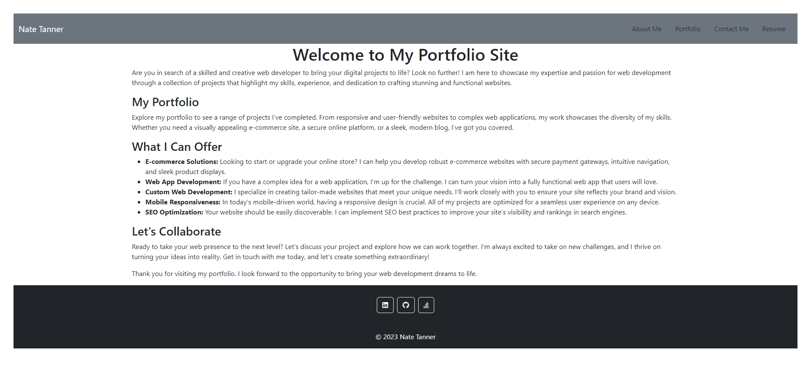

# Mod-20-React-Portfolio

## Description

A personal portfolio site to showcase my work during the course and outside the course.

## Installation

Project has a dependencies the user must run npm install to include the needed libraries.

## Usage

To run locally, run "npm i && npm run start" from the installed folder. 

The following image shows the application's appearance:

Project is also deployed to https://nate-tanner-portfolio.netlify.app/

## Credits

N/A

## License

N/A
